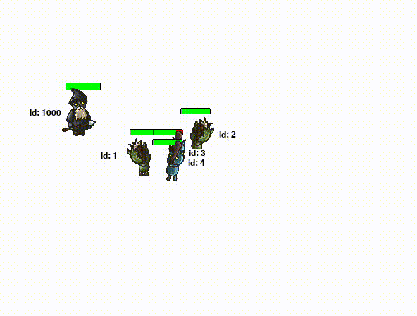
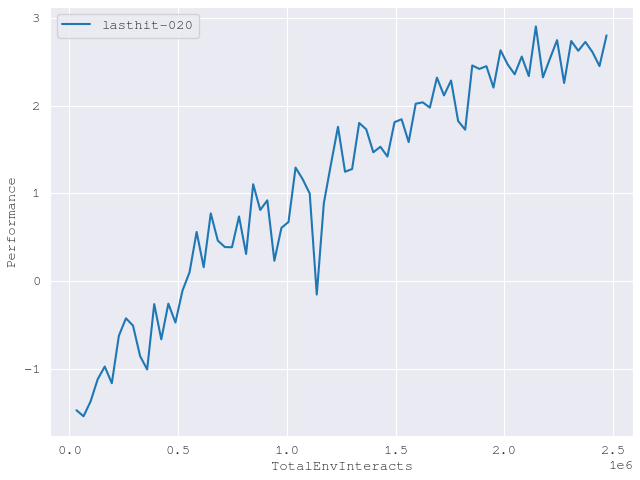

# Dota 2 Lasthit simulator

This repo contains simplified standalone `gym` environments (no need to have Dota 2) to build your knowledge on RL algorithms, inspired by OpenAI Five.

The best way to understand (and debug) neural networks is to start small and build upon them once you know exactly what they're doing (and that they **are working**), thus multiple `gym` environments with different complexity is offered that can be played with and developed further.

As DQN (and DDQN) were harder to get working (read: they get stuck in local optimum) I switch to the PPO algo implemented by OpenAI.

However starting from `Lasthit-m-v01` and anything `>v020` we need a multi-head network architecture which is provided by `ppo_mh` implementation.

## Preview



*Agent here has learned to position itself correctly near the creeps and attack them once to get the last hit! Surprisingly, it's skipping the first two creeps. Can you fix this bug?*



## Install

### Gym enviornments

After installing `gym` module using pip, move the `custom_envs` folder to its `envs` folder (better yet, create a symlink), eg:

```
/usr/local/lib/python3.6/dist-packages/gym/envs/custom_envs
```

Finally in `/gym/envs/__init__.py` register the new enviornments with:
```
# Custom
# ----------------------------------------

register(
    id='LastHit-v0',
    entry_point='gym.envs.custom_envs:LastHitEnvv0',
)

register(
    id='LastHit-v01',
    entry_point='gym.envs.custom_envs:LastHitEnvv01',
)

register(
    id='LastHit-m-v01',
    entry_point='gym.envs.custom_envs:LastHitEnvv01m',
)

register(
    id='LastHit-v020',
    entry_point='gym.envs.custom_envs:LastHitEnvv020',
)

```

### PPO Multihead

After installing [spinningup](https://github.com/openai/spinningup), move (or symlink) the `ppo_mh` folder to `/spinningup/spinup/algos/tf1/ppo_mh` and then configure `/spinningup/spinup/run.py` file to include the new `ppo_mh` algo:

```
BASE_ALGO_NAMES = ['vpg', 'trpo', 'ppo', 'ppo_mh', 'ddpg', 'td3', 'sac']
```

## Running

### Standalone

```
import gym

env = gym.make('LastHit-v0')

#state_size = env.observation_space.shape[0]
#action_size = env.action_space.n

env.reset()
total_reward = 0

for time in range(500):
	action = 1 if (time == 1 or time == 30) else 0
	next_state, reward, done, _ = env.step(action)
	
	total_reward += reward

	print ("tick = %d reward = %.2f done = %d from_action = %d hp = %d\nttna = %.2f(hero) %.2f %.2f %.2f %.2f distance = %d can_attack = %d" % (env.ticks, reward, done, action, *next_state,))

	if done:
		break

print ("total reward = ", total_reward)
```

### Spinningup

```
$ python3 -m spinup.run ppo --hid "[64,64]" --env LastHit-v01 --seed 1337 --exp_name lasthit01 --gamma 0.998 --max_ep_len 3000 --steps_per_epoch 32500 --epochs 150


$ python3 -m spinup.run ppo_mh_tf1 --hid "[64,64]" --env LastHit-v020 --seed 1337 --exp_name lasthit-020 --gamma 0.998 --max_ep_len 3000 --steps_per_epoch 32500 --epochs 50
```

Notice different `env` and different algo used above.

## TODO:

- [ ] Pick targets either randomly or by closeness 
- [ ] Add training checkpoint and option to resume training from it
- [ ] Separate pathfinding logic from pygame (avoid using Surface, etc)
- [ ] Improve path finding logic without using too much computation - current one ends up overlapping creeps and is visually hard to comprehend
- [ ] Add enemy hero so we can train network vs. network
- [ ] Add option for LSTM network
- [ ] Fix other issues with Spinup tools such as pickle issue with Surface objects and replay not playing because of `ppo_mh` multiple `pis`
- [ ] Why is it throwing `"run_entrypoint.py" is not responding. Force Quit / Wait?`
- [ ] Transfer from simulation to actual Dota 2 env
